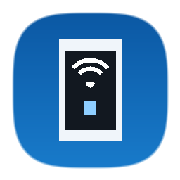

<p align="center">
  <b>ReNet</b>
</p>

<p align="center">
  
</p>

<p align="center">
  <b>简洁易用，轻巧流畅，基于Gnirehtet的安卓网络共享应用程序</b>
</p>

<p align="center">
  
  
  
  
  
</p>

<p align="center">
<b>仅需一条 USB 数据线，将移动设备接入电脑网络，一键开启，托盘常驻。</b>
</p>

## ✨ 功能/特性

- **一键启停**
- **静默常驻**
- **开机自启**
- **非侵入式**
- **MD3设计**
- **智能连接**
- **参数调控**
- **实时日志**
- **开箱即用**

## 🔧 环境配置

### 直接使用

- Windows **10/11**（x64）
- 下载便携版，双击运行即可

### 源码运行

- Windows **10/11**（x64）
- Node.js / npm
- 通过 `npm run setup-tools` 准备工具依赖

## 🚀 快速上手

### 1. 移动设备

1. 使用 USB 数据线将手机连接至电脑。
2. 开启 **【开发者选项】**
3. 打开 **【USB 调试】**
4. 弹出 `允许 USB 调试吗？` 提示时，勾选 **【始终允许使用这台计算机进行调试】** 并点击确定。

### 2. 运行 ReNet

- **使用便携版（推荐）**

  双击运行：

  ```text
  dist/ReNet-v1.x.x-Portable.exe
  ```

- **开发者环境**

  ```bash
  # 1. 安装依赖
  npm install

  # 2. 准备工具依赖
  npm run setup-tools

  # 3. 启动开发版
  npm start

  # 4. 构建打包单文件便携版
  npm run build
  ```

## 🛠️ 配置项说明

| 配置项 | 默认值 | 说明 |
| :--- | :--- | :--- |
| **DNS 服务器** | `223.5.5.5,119.29.29.29` | 解析域名 DNS。内置预设，亦可自定义 |
| **中继转发端口** | `31416` | 宿主机反向代理监听的本地 TCP 端口 |
| **ADB 工具来源** | 内置 | 可切换为 `PATH` 中的 ADB 或自定义路径 |
| **插线自动连接** | 开/关 | 检测到移动设备插入，自动开启网络共享 |
| **最小化到系统托盘** | 开/关 | 窗口关闭不退出程序，保持在后台托盘 |
| **开机自动启动** | 开/关 | 随 Windows 开机自启动，常驻托盘 |

## 📄 开源许可证与声明

- ReNet 遵循 [Apache License 2.0](LICENSE) 开源协议。
  - 第三方组件遵循各自许可证，详见 [NOTICE.md](NOTICE.md)。